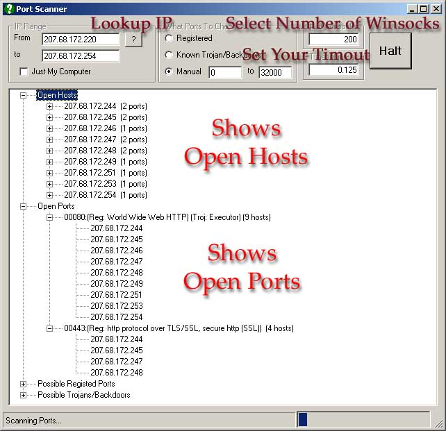

## Fast Port Scanner with Info about Port \(updated 12\-17\-01\)

### Description

Quickly scan your computer or subnet for open ports. Will show info about open port if in database. Scans 32,000 ports in less than a minute. You can update the database with new ports that are vulnerable. Mess with the number of winsocks that you use to see what works best on your computer. Feel free to send me an updated mdb I put it together from information collected from sites off the web. The ip resolve was submitted by someone on PSC can't remember the name. I wanted something that would show possible explanations for why the port was open and allow scanning for just known ports to speed up scan process. I let the system run as fast as it can through the winsocks using the next available winsock and looking for open states and tossing all others that have been trying to connect longer than the timeout setting. You can adjust this if it's to short for you particular connection. Comments appreciated
 
### More Info
 
Don't try to create thousands of winsocks. You'll run out of virtual memory. It also isn't faster. 200 was just about optimum for me.

             |
---                |---
**Submitted On**   |2001-12-17 10:22:06
**By**             |[Roger M\. Reeder](https://github.com/Planet-Source-Code/PSCIndex/blob/master/ByAuthor/roger-m-reeder.md)
**Level**          |Intermediate
**User Rating**    |4.9 (68 globes from 14 users)
**Compatibility**  |VB 6\.0, VBA MS Access
**Category**       |[Miscellaneous](https://github.com/Planet-Source-Code/PSCIndex/blob/master/ByCategory/miscellaneous__1-1.md)
**World**          |[Visual Basic](https://github.com/Planet-Source-Code/PSCIndex/blob/master/ByWorld/visual-basic.md)
**Archive File**   |[Fast\_Port\_4268012172001\.zip](https://github.com/Planet-Source-Code/roger-m-reeder-fast-port-scanner-with-info-about-port-updated-12-17-01__1-29480/archive/master.zip)

